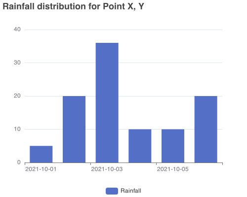

# Echarts Render

Create Echarts Static images using a Node JS HTTP interface.

Under the hood, node-canvas is used to render the charts from a json 
 configuration passed as body to a POST request.


## Installation

To run locally:

```bash
  git clone https://github.com/icpac-igad/echarts-renderer.git

  cd echarts-renderer

  yarn

  yarn dev
```

By default the application will run on port `3000`

You can configure this by passing an Environmental variable by name
`PORT`

e.g by running:

`PORT=3002 yarn dev`


## Usage/Examples

The node js application exposes a POST endpoint at
`/api/v1/echarts/render`

This endpoint expects the following:

- 2 url parameters
    - `width` - The width of the rendered chart in pixels. Max value `1000`
    - `height` - The height of the rendered chart in pixels. Max Value `1000`

- A `JSON` echarts [option](https://echarts.apache.org/en/option.html) body. See example below

If the echart configuration option passed is ok, an `image/png` response will be returned of the rendered chart

Below is an example of a request using [axios](https://github.com/axios/axios)

```javascript
var axios = require('axios');
var data = JSON.stringify({
  "title": {
    "text": "Rainfall distribution for Point X, Y"
  },
  "legend": {
    "data": [
      "Rainfall"
    ]
  },
  "xAxis": {
    "data": [
      "2021-10-01",
      "2021-10-02",
      "2021-10-03",
      "2021-10-04",
      "2021-10-05",
      "2021-10-06"
    ]
  },
  "yAxis": {},
  "series": [
    {
      "name": "Rainfall",
      "type": "bar",
      "data": [
        5,
        20,
        36,
        10,
        10,
        20
      ]
    }
  ]
});

var config = {
  method: 'post',
  url: 'http://localhost:3000/api/v1/echarts/render?width=500&height=400',
  headers: { 
    'Content-Type': 'application/json'
  },
  data : data
};

axios(config)
.then(function (response) {
  console.log(response.data);
})
.catch(function (error) {
  console.log(error);
});
```

